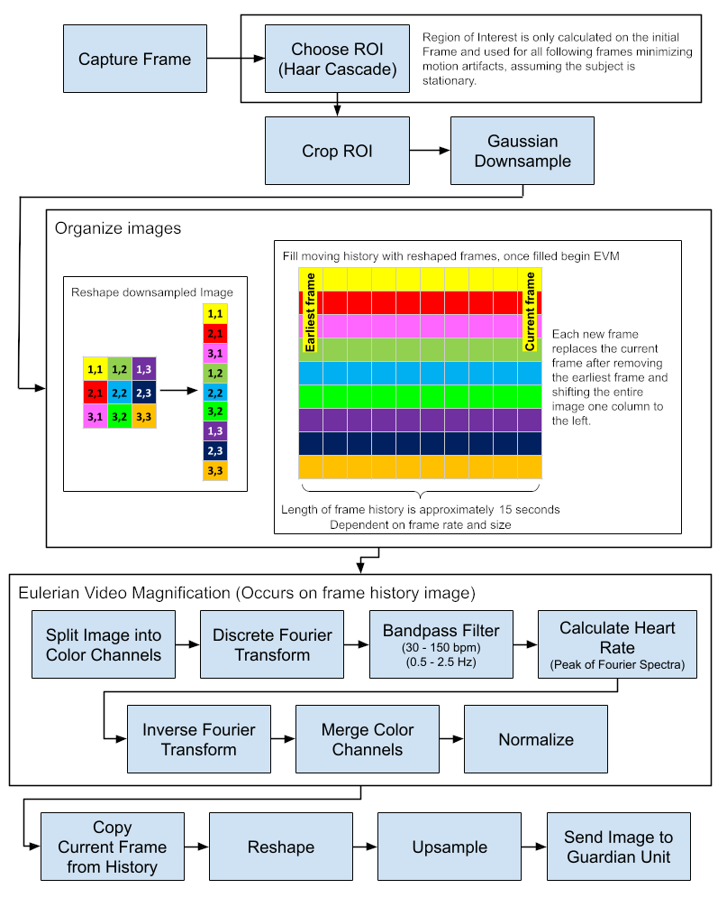

# mazuMedical

Presented originally as a smart baby monitor that can estimate heart rate and respond to a low heart rate / no heart rate scenario to warn parents.

C++ & Qt application to perform eulerian video filtering (color magnification for heart rate estimation) on one Raspberry Pi and send video feed to another Pi.

> Note: Requires [building Qt from source](https://wiki.qt.io/Building_Qt_6_from_Git) with sctp enabled (eg. `configure ... -sctp`). 
> - Requires package(debian): `libsctp1-dev`, after configure check the `config.summary` in the build folder for `SCTP........yes`
> - SCTP ([stream controlled transmission protocol](https://en.wikipedia.org/wiki/Stream_Control_Transmission_Protocol)) is not available on Windows

One Raspberry Pi (server) acts as a camera and performs euclidean video magnification to estimate heart rate. The results are sent (sctp) to the other Raspberry Pi (client) which displays the video along with the heart rate estimation. 

[link to poster](./resources/imgs/MazuMedicalPoster.pdf)

### Algorithm Overview

### TODOs
- [ ] PySide implementation? 
  - Pros:
    - ring buffer already verified 
    - I am more comfortable with python
  - Cons: 
    - Major refactoring
    - generating PySide6 bindings after build Qt with sctp appear to link QSctp[Server|Socket] classes
- [ ] separate image capture and server's frame buffer maintenance from algorithm implementation
- [ ] add additional algorithms for
  - [ ] breathing rate detection (eulerian **motion** magnification -- laplacian spatial decomposition)
  - [ ] movement (Optical Flow)
- [ ] Hardware, from the ground up 
  1. [ ] move from raspberry pi to STM32 mcu (openMV -- H7)
  2. [ ] move from openMV to STM32 Nucleo/discovery board and purchased image sensor (AR0134CS) -- Image sensor I really want (OV2312).
  3. [ ] ecg and breath sensing with traditional methods (use to verify algorithm)
  3. [ ] Find manufacturer for prototype run.

